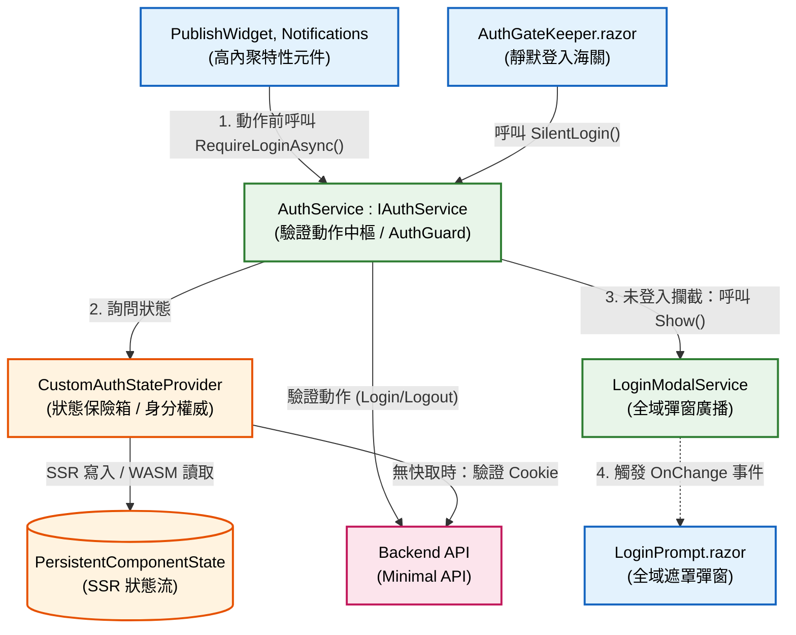
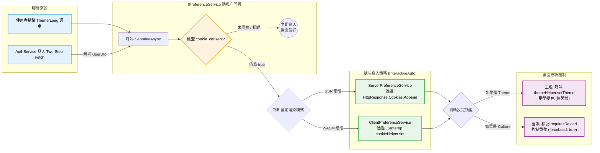

# Blazor InteractiveAuto Labs 

本儲存庫為 **Blazor InteractiveAuto (SSR + WASM 混合模式)** 的實驗與概念驗證（PoC）專案，專注於研究混合渲染模式下的水合現象（Hydration）、狀態同步、生命週期控管以及極致的使用者體驗優化。

## 🧪 已實現之技術實驗清單

下方列出專案中針對各種技術痛點所進行的實驗與實作場景：

| 技術主題 / 機制 | 實驗目的與解決痛點 | 核心實作位置 |
| :--- | :--- | :--- |
| **InteractiveAuto 生命週期** | 驗證兩端生命週期重複執行機制，進行正確的資料抓取控管。 | `App.razor` / 各頁面組件 |
| **Hydration 抗閃爍動畫** | 透過環境感知（IsBrowser），在 WASM 水合接管前鎖定樣式，避免 UI 閃爍。 | `MainLayout.razor` (`isHydrating`) |
| **Persistent Component State** | 將 SSR 階段抓取好的資料封裝傳遞至 WASM，防治 Hydration 資料二次載入閃爍。 | `CustomAuthStateProvider.cs` |
| **網址 Ticket 背景靜默登入** | 訪客進入時，由瀏覽器背景靜默換取 Cookie 身分，並自動清理網址列參數。 | `AuthGateKeeper.razor` |
| **多帳號身分衝突攔截** | 當瀏覽器已有人登入卻又帶入新 Ticket 時，攔截流程並顯示衝突解決彈窗。 | `AuthGateKeeper.razor` / `AccountConflictModal` |

## 🔐 身分驗證與狀態管理架構 (BFF Auth Architecture)

本專案採用 Blazor Auto Render Mode，並實作了基於 BFF (Backend-for-Frontend) 模式的嚴謹身分驗證機制。透過 `PersistentComponentState` 解決了 SSR 到 WASM 的 Hydration 狀態閃爍問題，並實現了極高內聚的權限攔截系統。

### 架構依賴關係圖

## 🌟 智慧型雙端偏好同步與隱私防護 (BFF & GDPR Compliant Preference Sync)

本專案針對 Blazor InteractiveAuto 模式，打造了極度嚴密的使用者偏好（Theme、i18n）同步架構，確保跨裝置體驗無縫接軌且符合現代隱私法規。

### 隱私法規守門員 (Cookie Consent Gatekeeper)

所有的 UX Cookie 寫入動作均由底層的 `IPreferenceService` 進行攔截。
- **Non-Essential Cookies (Theme, Culture)：** 必須在使用者點擊「同意」橫幅（寫入 `cookie_consent=true`）後，系統才允許將偏好寫入瀏覽器。若未同意，系統依然正常運作，但退回系統預設且不留痕跡。
- **Strictly Necessary Cookies (AccessToken)：** 由後端 API 透過 `HttpOnly` Response Header 直接寫入，免疫 XSS 攻擊且不被同意橫幅阻擋，確保核心驗證邏輯暢通。

### Two-Step Fetch 登入同步機制

為了確保乾淨的 API 職責分離：
1. **驗證階段：** 前端呼叫 `/api/mock/login` 僅換取乾淨的 `Token`。
2. **偏好拉取：** 攔截器立刻攜帶 Token 呼叫 `/api/mock/me` 獲取完整 `UserDto`。
3. **智慧重整 (Smart Reload)：** 系統比對雲端偏好與本地 Cookie 差異，僅在「語系 (Culture)」真正發生改變時，才觸發 `forceLoad: true`，大幅減少不必要的畫面閃爍。

### 雙端寫入策略 (InteractiveAuto Compatibility)

- **SSR 階段登入：** 透過 `ServerPreferenceService` 注入 `IHttpContextAccessor`，將設定附加於 HTTP Response Header 送回客戶端，避免 Hydration 閃爍。
- **WASM 階段登入：** 透過 `ClientPreferenceService` 呼叫原生 JavaScript (`cookieHelper` / `themeHelper`)，達成瞬間的主題熱切換。

### 架構依賴關係圖

