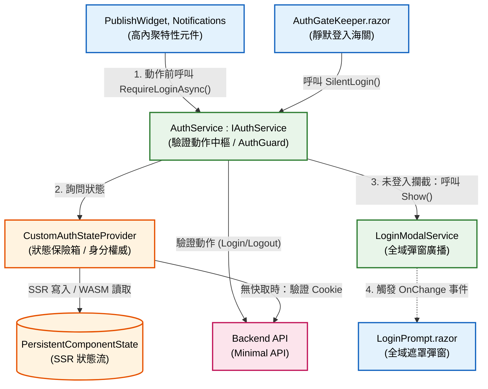
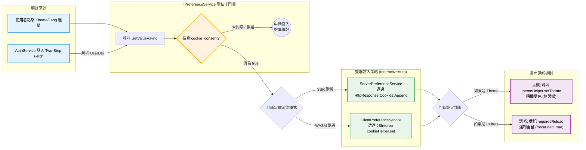
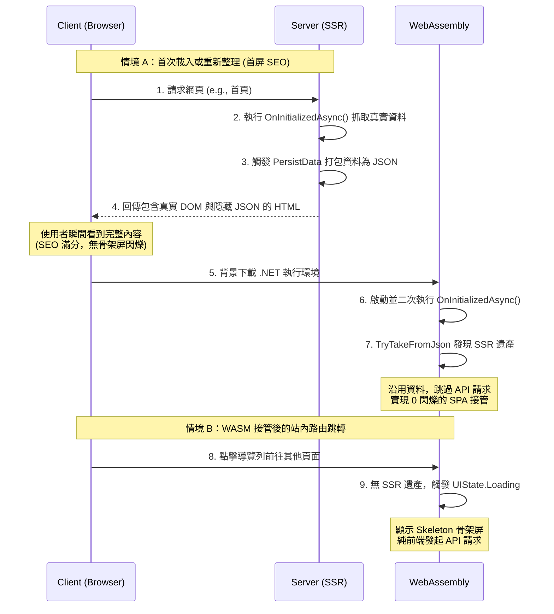

# Blazor InteractiveAuto Labs 

本儲存庫為 **Blazor InteractiveAuto (SSR + WASM 混合模式)** 的實驗與概念驗證（PoC）專案，專注於研究混合渲染模式下的水合現象（Hydration）、狀態同步、生命週期控管以及極致的使用者體驗優化。

## 🧪 已實現之技術實驗清單

下方列出專案中針對各種技術痛點所進行的實驗與實作場景：

| 技術主題 / 機制 | 實驗目的與解決痛點 | 核心實作位置 |
| :--- | :--- | :--- |
| **InteractiveAuto 生命週期** | 驗證兩端生命週期重複執行機制，進行正確的資料抓取控管。 | `App.razor` / 各頁面組件 |
| **Hydration 抗閃爍動畫** | 透過環境感知，在 WASM 水合接管前鎖定樣式，避免 UI 閃爍。 | `MainLayout.razor` (`isHydrating`) |
| **網址 Ticket 靜默登入** | 訪客進入時，由瀏覽器背景靜默換取 Cookie 身分，並自動清理網址。 | `AuthGateKeeper.razor` |
| **多帳號身分衝突攔截** | 當瀏覽器已有人登入卻又帶入新 Ticket 時，攔截並顯示衝突解決彈窗。 | `AuthService.cs` / `LoginPrompt` |
| **BFF 雙端偏好同步** | 結合 GDPR 同意機制，將雲端 Theme/i18n 偏好於 SSR/WASM 雙端無縫寫入。 | `PreferenceService` 實作 |
| **全域 UI 狀態機包裹器** | 打造 `<StateBoundary>`，統一處理 Loading、Success、Empty、Error 四大狀態。 | `StateBoundary.razor` |
| **骨架屏與 CLS 防治** | 實作 Skeleton 佔位，抽離 JS 依賴至 Service，消滅累積版面配置轉移 (CLS)。 | `PostCardSkeleton.razor` |
| **SSR 水合狀態無縫繼承** | 透過 `PersistentComponentState` 將 SSR 首屏資料轉交 WASM，達成零閃爍接管。 | `CustomAuthStateProvider.cs` |

## 🌟 核心架構亮點 (Core Architecture Highlights)

### 1. 零信任身分驗證與狀態管理架構 (Zero-Trust Auth & Security)

本專案建立了一套高內聚的身分安全體系，確保使用者身分在 SSR 與 WASM 切換間始終保持一致且不受劫持。

#### 身分權威機制 (Identity Authority)

- **CustomAuthStateProvider:** 作為全域身分保險箱，嚴格控管 AuthenticationState。透過與後端 API 緊密綁定，確保身分驗證結果在 InteractiveAuto 雙端渲染時的絕對一致性，徹底解決了 SSR 與 WASM 因不同步導致的身分閃爍問題。

- **AuthGateKeeper (靜默登入海關):** 針對訪客進入網頁的場景，實作了背景靜默換票機制。系統能自動辨識網址參數中的臨時 Ticket，在不打擾使用者的情況下完成身分校驗，並自動清理網址列，維持乾淨的 URI。

#### 異常防護與衝突攔截

- **多帳號衝突偵測:** 當偵測到瀏覽器已存在舊的登入憑證，卻又接收到新的身分請求時，系統會立即觸發「身分衝突保護機制」，攔截並強制要求使用者決策（保留舊身分或切換為新身分），防範會話劫持風險。

- **嚴謹的 AuthGuard:** 封裝了 AuthService 作為權限守門員，任何涉及敏感操作（如發文、點讚）的元件，必須透過 RequireLoginAsync 的強檢查，確保未登入使用者無法非法觸發後端 API。

#### 架構依賴關係圖

### 2. 智慧型雙端偏好同步與隱私防護 (BFF & GDPR Compliant Preference Sync)

本專案針對 Blazor InteractiveAuto 模式，打造了極度嚴密的使用者偏好（Theme、i18n）同步架構，確保跨裝置體驗無縫接軌且符合現代隱私法規。

#### 隱私法規守門員 (Cookie Consent Gatekeeper)

所有的 UX Cookie 寫入動作均由底層的 `IPreferenceService` 進行攔截。
- **Non-Essential Cookies (Theme, Culture)：** 必須在使用者點擊「同意」橫幅（寫入 `cookie_consent=true`）後，系統才允許將偏好寫入瀏覽器。若未同意，系統依然正常運作，但退回系統預設且不留痕跡。
- **Strictly Necessary Cookies (AccessToken)：** 由後端 API 透過 `HttpOnly` Response Header 直接寫入，免疫 XSS 攻擊且不被同意橫幅阻擋，確保核心驗證邏輯暢通。

#### Two-Step Fetch 登入同步機制

為了確保乾淨的 API 職責分離：
1. **驗證階段：** 前端呼叫 `/api/mock/login` 僅換取乾淨的 `Token`。
2. **偏好拉取：** 攔截器立刻攜帶 Token 呼叫 `/api/mock/me` 獲取完整 `UserDto`。
3. **智慧重整 (Smart Reload)：** 系統比對雲端偏好與本地 Cookie 差異，僅在「語系 (Culture)」真正發生改變時，才觸發 `forceLoad: true`，大幅減少不必要的畫面閃爍。

#### 雙端寫入策略 (InteractiveAuto Compatibility)

- **SSR 階段登入：** 透過 `ServerPreferenceService` 注入 `IHttpContextAccessor`，將設定附加於 HTTP Response Header 送回客戶端，避免 Hydration 閃爍。
- **WASM 階段登入：** 透過 `ClientPreferenceService` 呼叫原生 JavaScript (`cookieHelper` / `themeHelper`)，達成瞬間的主題熱切換。

#### 架構依賴關係圖

### 3. 全站 UI 狀態機與無縫水合 (Global UI State Machine & Seamless Hydration)
為解決 InteractiveAuto 模式下最棘手的「水合閃爍 (Hydration Flicker)」與「版面吞噬 (CLS)」，本專案導入了標準化的狀態服務與骨架屏機制。

#### 泛型狀態包裹器 (StateBoundary)
設計 `<StateBoundary>` 元件，統一管理非同步載入的四大生命週期：
- **Loading:** 顯示具備脈動動畫的骨架屏 (Skeleton)，安撫等待焦慮並佔位防止 CLS。
- **Success:** 渲染真實資料。
- **Empty / Error:** 處理空狀態引導與例外防呆重試機制。

#### SSR 資料遺產繼承 (PersistentComponentState)
完美解決 SEO、UX 與 API 請求浪費的三角難題。系統會根據使用者的「進入路徑」智能決定渲染策略。

#### 水合無縫接軌流程圖 (Hydration Sequence)

